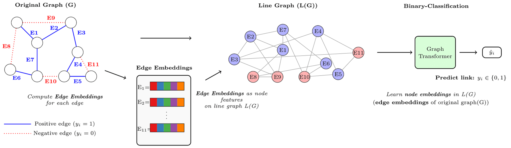
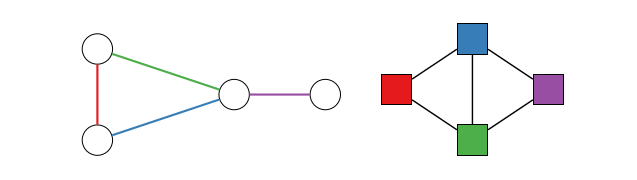

# DuoLink: A Dual Perspective on Link Prediction via Line Graphs



**DuoLink** is a novel framework that reformulates **link prediction** as **node classification on the line graph** of the original network.  
This approach directly models edge-level structures, integrates classical heuristics, and aligns naturally with the inductive biases of Graph Neural Networks (GNNs) and graph transformers.

---

## 🚀 Key Features
- **Line Graph Reformulation** – Transforms the link prediction task into node classification on the line graph for better inductive bias alignment.
- **Heuristic Integration** – Seamlessly combines classical proximity indices (e.g., Common Neighbors, Adamic–Adar) with learned representations.
- **Homophily & Heterophily Robustness** – Handles both similarity-driven and structurally diverse connections.
- **Model Agnostic** – Works with GCN, GIN, GraphSAGE, DeepGCN, GatedGraph, SGFormer, Polynormer, and more.
- **Proven Performance** – Outperforms heuristic baselines and state-of-the-art GNNs across multiple benchmarks.

---

## 📜 Methodology

### 1. Line Graph Construction
Given an input graph `G(V, E)`:
- Each **edge** in `G` becomes a **node** in the line graph `L(G)`.
- Two nodes in `L(G)` are connected if their corresponding edges in `G` share an endpoint.



### 2. Feature Initialization
For each edge `(u, v)` in `G`:
- **Structural Features**: Common Neighbors, Jaccard, Adamic–Adar, etc.
- **Attribute Features**: Optional similarity measures from node features.

### 3. GNN/Transformer Backbone
Apply a GNN or graph transformer on `L(G)` to learn **edge-node embeddings**.

### 4. Prediction
A simple binary classifier predicts whether an edge exists in the original graph.

---

## 📊 Benchmarks

### Homophilic Graphs
DuoLink-enhanced models (e.g., DL-SAGE, DL-Polynormer) achieve **near-perfect Hits@100** on Cora, Citeseer, and Pubmed.

### Heterophilic Graphs
On datasets like Texas, Cornell, and Actor, DuoLink **outperforms specialized heterophily-aware models** by large margins in AUC.


---

## 📦 Installation
```bash
git clone https://github.com/yourusername/DuoLink.git
cd DuoLink
pip install -r requirements.txt
